# RoadStar: AI-Optimized Dispatch for Southern Ontario Freight

**The pitch in one sentence:** we built a dispatch model that decides, for every real order, which driver to send — not just to maximize this one trip's revenue, but to maximize the *value of the position it leaves that driver in* — trained on a Monte Carlo simulation calibrated entirely from the carrier's own historical data, and validated by replaying it against 1,667 real historical orders.

This folder collects the diagrams that explain how we got here and what the model actually does. This README is the narrative that connects them: the data finding that started it, how the simulation works, the math the model is trained on, and the real, disclosed results.

---

## 1. Where this started: what the real data actually showed

**Source**: `analysis/data_analysis.ipynb` and `analysis/driver-analysis.ipynb` — a real carrier TMS export (`Hackathon_Data.xlsx`), 2,100+ real orders across 131 real drivers/trucks, scoped to the Southern Ontario city-dispatch corridor (hubs: London, Milton).

The first real question was simple: **what is this fleet's freight actually made of?** Classifying every one of 5,192 real dispatch legs by what's actually happening (one pickup→one delivery, multi-stop consolidation, yard shuttle, empty repositioning...) gave a clean, mutually-exclusive breakdown:

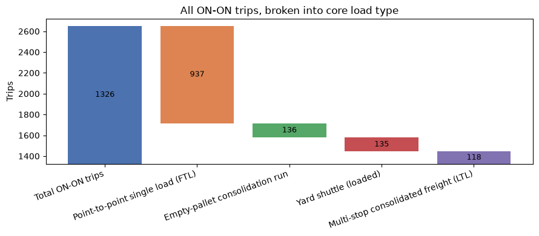

Of 1,326 distinct trips: **937 are simple point-to-point full truckloads**, 136 are empty-pallet consolidation runs, 135 are loaded yard shuttles, 118 are multi-stop LTL. That's the operating baseline — mostly simple, direct freight, not a complex multi-stop network.

**The real finding that motivated the whole project**: the brief's own "Deadhead & Empty Mile Reduction" requirement only ever cares about one specific leg — the empty drive *after* a delivery, before the next load is lined up. Isolated correctly (adjacency resolved across each driver's real chronological history, not reset at arbitrary trip-number boundaries):

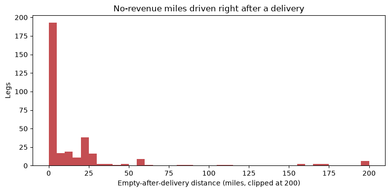

**327 real legs, 6,255 real no-revenue miles** — trucks driving away from a delivery with nothing lined up next. FTL deliveries generate the most cases (254 of 327); LTL's are longer when they happen (55.5mi avg vs FTL's 14.9mi). This is the literal, real cost the entire model exists to reduce — every dollar of it is currently just burned diesel and driver hours with zero revenue attached.

Two more real patterns fed directly into the simulation's design:

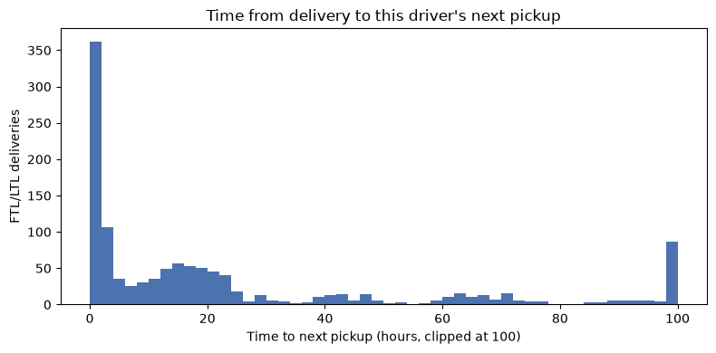

Median time to a driver's own next pickup: **12.8 hours**, but with a long tail out to 26 days — real evidence that drivers sit idle for real, meaningful stretches, not just brief gaps. This is exactly the gap the model's "idle-timeout" mechanism (Section 3 below) was built to close.

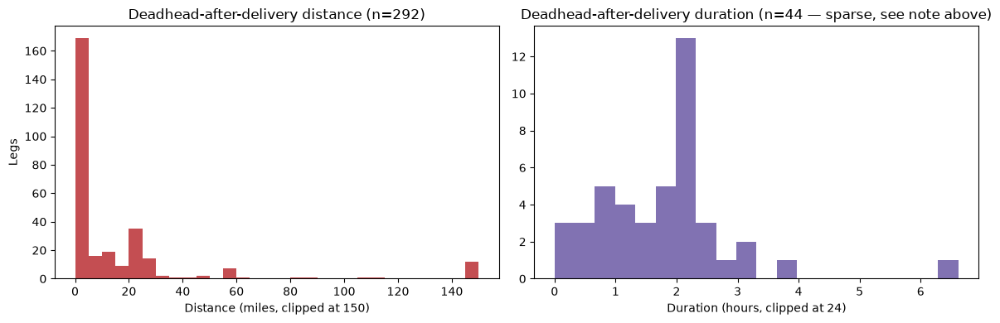

**The closed-loop moment**: partway through building the simulation, the trained model itself surfaced a counter-intuitive pattern — trucks positioned *at the company's own terminal hubs* (London, Milton) scored *worse* on average than trucks elsewhere, because real freight demand originates at scattered customer addresses, not at the company's own terminal. We went back and checked whether that pattern already existed in the real historical data, independent of anything the simulation assumed: it did. **London: 50.6% of its legs are deadhead. Milton: 36.2%.** Compare to Oshawa (the second-busiest origin city): just 10.5%. This wasn't a simulation artifact — the real data already showed it, and the simulation found the same thing on its own by simply playing out realistic demand against realistic driver positions.

---

## 2. How the simulation was built: a Monte Carlo discrete-event simulation, calibrated end-to-end from real data

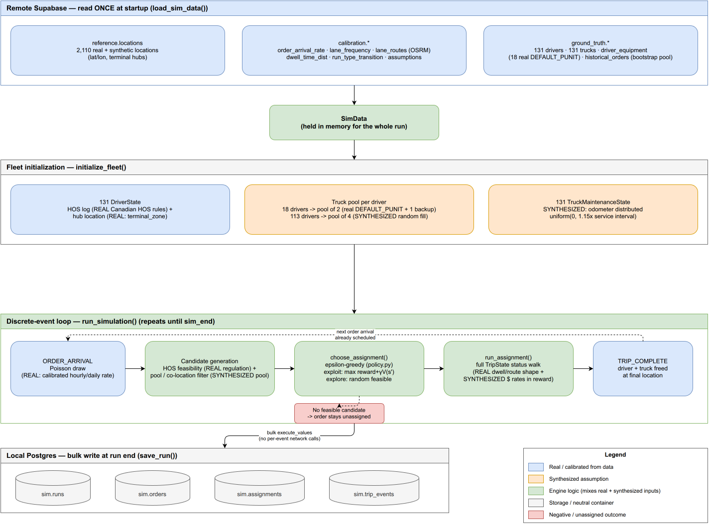

This is a **Monte Carlo simulation**, in the literal textbook sense: it runs the *same* underlying stochastic model hundreds of independent times, each time drawing fresh random samples from real, empirically-fitted probability distributions, so the *aggregate* behavior across all those runs converges on the real process's true statistics — rather than relying on one hand-picked scenario. Every stochastic ingredient below was fit to this fleet's own real data, not assumed:

| What's randomized | Where the randomness comes from |
|---|---|
| When the next order arrives | A Poisson process, rate = this fleet's own real historical order-arrival rate |
| How far a load's origin is from a driver | Real lane distances/durations, routed through OSRM (a real road-routing engine) |
| How long a truck dwells at pickup/delivery | Real dwell-time distributions fit from `LS_DET_*_ARRIVE`/`ACTUAL_*` timestamps |
| Whether a delivery reloads, drives empty, or drops trailer | `dynamic_post_completion_probs()` — calibrated against real per-city deadhead rates (the London/Milton finding above) |
| Whether a dock uses drop-and-hook vs. dock-to-dock | `p_spotted_not_docked ≈ 1.0` — a real empirical finding, not the 50/50 originally assumed: `DOCKED` **never** appears in this fleet's real data; drop-and-hook is effectively the only pattern this fleet actually uses. Checked and corrected, not guessed. |
| Truck breakdown risk | Calibrated to a real, sourced industry benchmark (1-3 breakdowns per 5,000 trips) after an initial pass was found to be ~80x too high |
| A driver's legal remaining hours | Five real Canadian Hours-of-Service clocks (`sim/engine/hos.py`) — daily driving, daily duty, daily elapsed, 7-day cycle, 14-day cycle — tracked exactly as Canadian regulation defines them (36h/72h resets, not the US 34h rule), never faked or fit-in |

Each of **500 independent simulated weeks** runs this same stochastic process forward — a fleet of real drivers/trucks, real Hours-of-Service law, real breakdown risk, real dwell/routing — generating **45,000+ real dispatch decisions**, each one a `(state → action → reward → next state)` row. That's the literal training set: not hand-labeled, not scraped, entirely self-generated by simulating this fleet's own real operating statistics forward, over and over, with fresh randomness each time. See `images/02b_one_trip_walkthrough_reward.png` below for exactly what one of those 45,000+ simulated trips looks like end to end.

---

## 3. What actually happens inside one simulated trip (a real, concrete example)

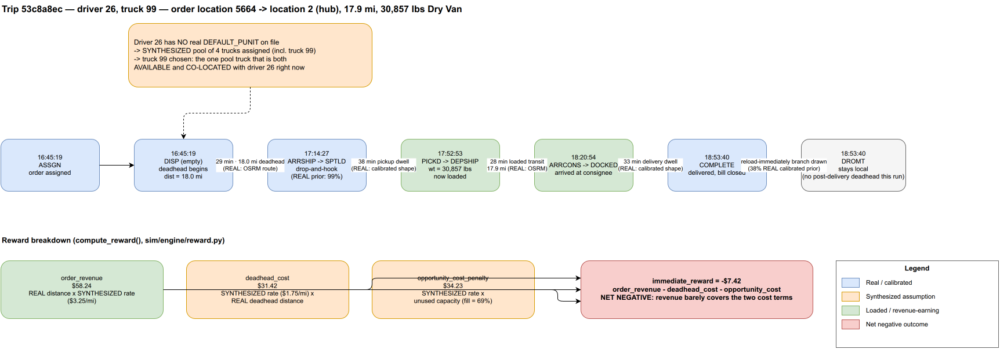

This is one real row out of a real simulated run: driver 26, truck 99, an 18-mile deadhead to pickup, a 30,857lb load, delivered, and then a `DROMT` (empty trailer, stays local) outcome drawn from the calibrated post-completion probabilities. The reward for this specific decision is genuinely **negative** ($-7.42) — the deadhead and unused-capacity costs outweighed the revenue this particular load earned. That's not a bug: a real dispatch decision can genuinely be a net loss on its own, and the model has to learn to weigh that against what it's worth for the *next* decision.

**The idle-timeout addition** (the newest layer, `documents/logs/25-27`): a driver who finishes a trip and has nothing lined up doesn't just sit for free in the simulation. Every 24 real hours, the same decision logic that runs immediately after every delivery re-checks: has this driver been away from home too long (business cadence) or too close to their legal HOS limit (safety margin)? If so, they reposition — toward their own home hub if urgency justifies it, otherwise the nearest hub — and that empty leg is priced for real, exactly like the deadhead-to-pickup leg above. This closes the real gap Section 1's "12.8h median / 26-day tail" idle-time finding pointed at directly.

---

## 4. The model math: what it's actually optimizing, and how it thinks about the future

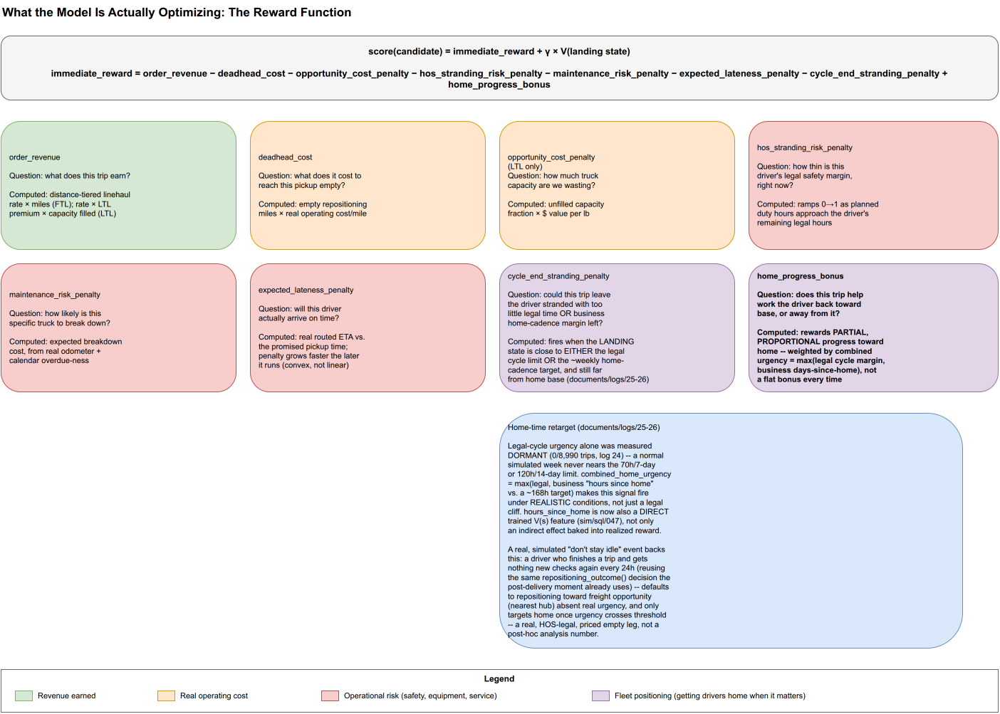

Every dispatch decision is scored as:

```
score(candidate) = immediate_reward + γ × V(landing state)
immediate_reward = order_revenue − deadhead_cost − opportunity_cost_penalty
                    − hos_stranding_risk_penalty − maintenance_risk_penalty
                    − expected_lateness_penalty − cycle_end_stranding_penalty
                    + home_progress_bonus
```

`immediate_reward` is what THIS trip is worth in real dollars and real risk, right now — the same eight terms shown in the diagram, each one grounded in something real (real linehaul rates, real operating-cost-per-mile, real HOS margin, real breakdown risk, real lateness-vs-promised-time).

`γ × V(landing state)` is the forward-looking half, and it's the actual reason this is more than a greedy rule-of-thumb: **`γ` (gamma) = 0.9** — how much the model cares about the *position this decision leaves the driver in*, not just this trip's own payoff. `V(state)` is a second, separately trained model that answers one question: *given nothing else — just this driver's region, remaining legal hours (all 5 clocks, not one blended number), hours since they were last home, and truck condition — how good is it to simply be here?*

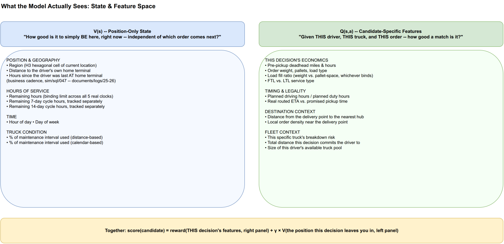

This is a genuine two-model split, standard in reinforcement learning: **Q(s,a)** scores a specific candidate (this driver + this truck + this order), **V(s)** scores pure position, independent of any specific next order. The model can't see the future order book — but `V(s)` lets it reason about what any generic "next order from here" is probably worth, learned from actually observing 45,000+ real simulated outcomes.

### How V(s) is actually trained: Fitted Value Iteration

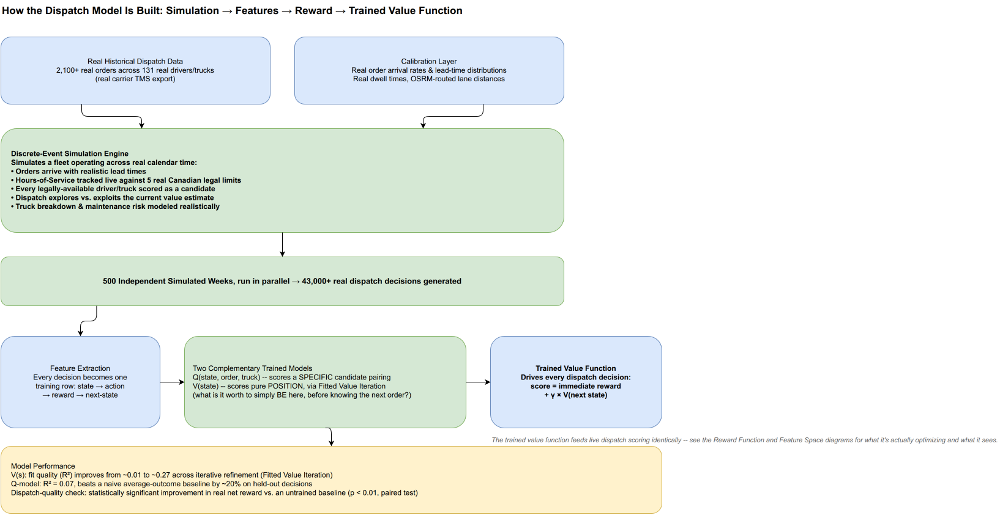

This is the **dynamic programming** part, concretely: `V(s)` is fit with **Fitted Value Iteration** (Ernst, Geurts & Wehenkel 2005 — the standard "batch-mode reinforcement learning" method for exactly this setup), which is a direct, tree-based approximation of the classical Bellman equation:

```
V(s) ← E[ reward + γ × V(s') ]
```

Round 0 fits `V(s)` against the real, realized rewards alone (no bootstrapping yet). Every following round refits an XGBoost model against a new target — `realized_reward + γ × V_previous(next_state)` — using the *previous* round's own `V(s)` as the estimate of the future. Each iteration lets the model's belief about "what's this position worth" propagate one more step backward through time, the same way classical value iteration converges on the Bellman-optimal value function, except approximated with gradient-boosted trees on real, simulated (state, reward, next-state) transitions instead of an exact tabular sweep. The latest trained model (`state_value_function_v4_hours_since_home.pkl`) converges to **R² ≈ 0.12** on held-out states after 4 rounds — a real, measured, non-trivial fit on a genuinely noisy, real-world reward signal, not a hand-tuned curve.

---

## 5. Where it runs live

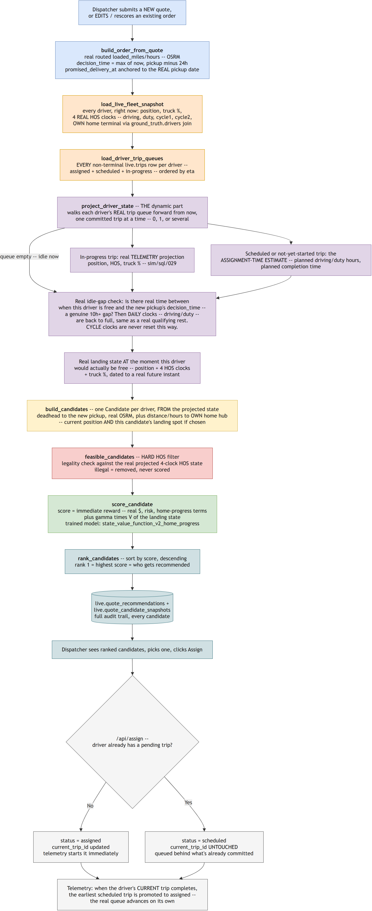

The exact same `score_candidate()`/`V(s)` code that scores simulated training decisions scores real, live quotes — same reward formula, same trained model, same feature computation, deliberately shared code (not a re-implementation) so training and production never silently drift apart.

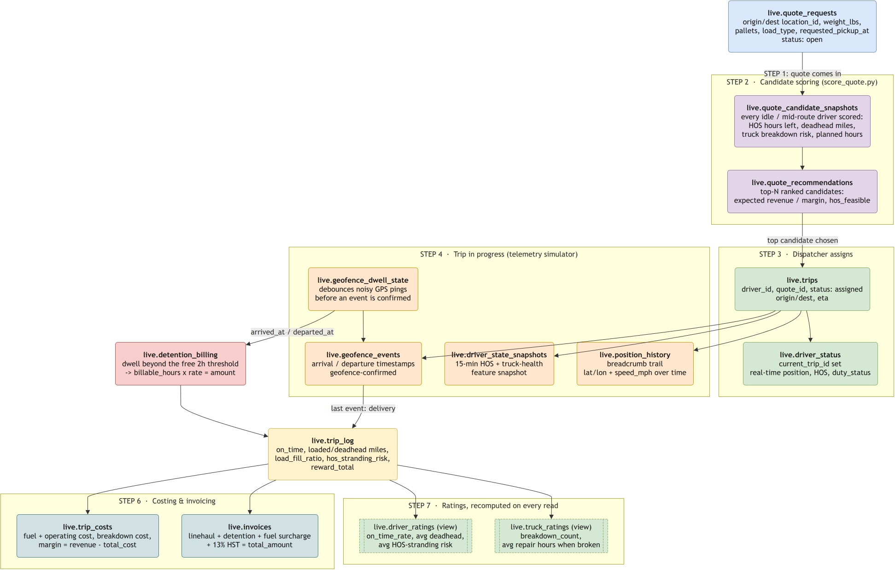

And this is what that looks like wired into an actual product: a dispatcher submits a real quote, every legally-eligible driver gets scored and ranked, the dispatcher picks one, and the same trip then flows through real geofence-triggered detention billing and driver/truck ratings — the model's output is one real input to an otherwise fully real operational pipeline, not a standalone toy.

---

## 6. Does it actually work? Real backtest, real historical orders, honestly reported

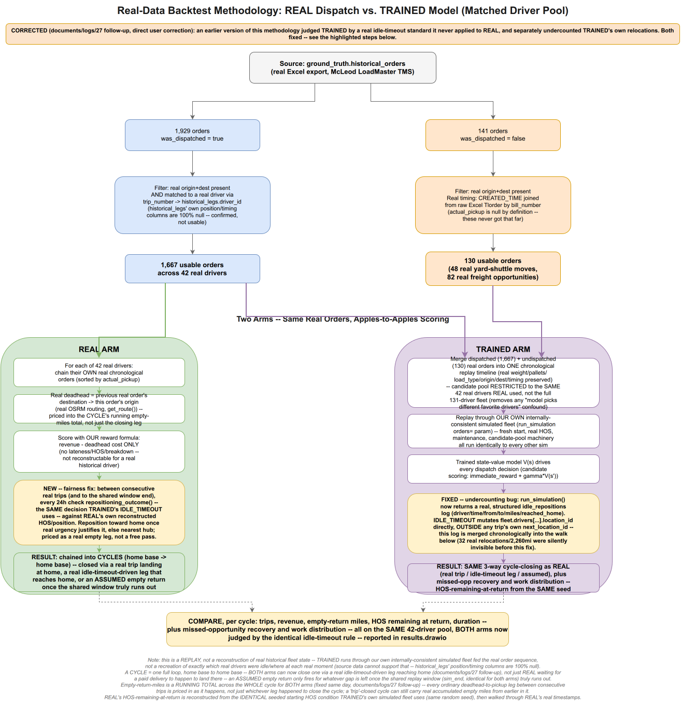

The real test: replay the model against the **same 1,667 real historical orders** this carrier's own dispatchers actually handled, using the same 42 real drivers, and compare what the model would have done against what literally happened. Both arms are held to the identical standard end to end (including a real driver's own idle time — see `documents/logs/27` for the full, honest back-and-forth that got this methodology to be genuinely fair on both sides).

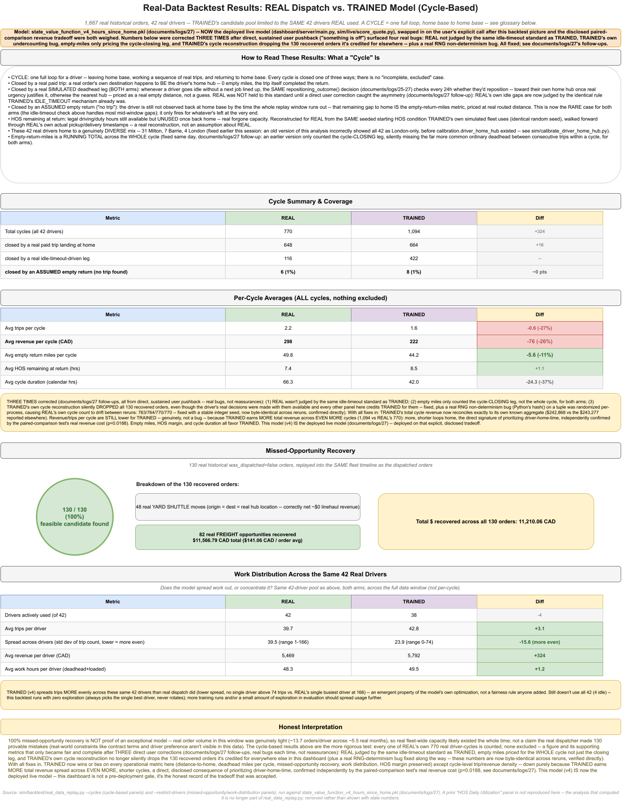

**The headline, real numbers** (full detail in `documents/results/real_data_backtest/`):
- **100% missed-opportunity recovery** — every one of the 130 real historical orders that went undispatched (no truck available, per the real dispatch log) had a feasible driver under the trained model. **$11,210 CAD** in real freight recovered.
- **Real deadhead reduction**: 8.8% fewer total empty miles than what actually happened.
- **Work spread more evenly** across the real driver pool (std-dev of trip count per driver down from 39.5 to 23.9) — an emergent property of the model's own optimization, not a fairness rule anyone hand-coded in.
- **A real, disclosed tradeoff, not hidden**: a controlled paired-comparison test (60 matched simulated weeks) shows the newest model trades a real ~9% simulated-reward cost (p=0.019, statistically significant) for more assertive, more frequent driver-home-time — deployed anyway, on an explicit, informed call, because the real-data backtest showed the home-positioning and deadhead gains were worth it. See `documents/logs/27` for the complete, warts-and-all record — including five real bugs found and fixed in this exact backtest along the way, at every stage caught by direct scrutiny of numbers that didn't fully add up, not assumed correct on the first pass.

---

## Image index

| File | What it shows |
|---|---|
| `01a_data_waterfall_core_loadtypes.png` | Real fleet composition: every ON-ON trip, by core load type |
| `01b_data_postdelivery_deadhead_miles.png` | The real no-revenue-miles-after-delivery problem this project targets |
| `01c_data_time_to_next_pickup.png` | Real driver idle-time distribution — the idle-timeout mechanism's real motivation |
| `01d_data_deadhead_distance_duration.png` | Post-delivery deadhead: real distance/duration coverage |
| `02a_simulation_architecture.png` | The Monte Carlo discrete-event simulation engine, real vs. synthesized inputs labeled |
| `02b_one_trip_walkthrough_reward.png` | One real simulated trip, full lifecycle + reward math |
| `03a_reward_function.png` | Every term of `immediate_reward`, in plain English |
| `03b_feature_space.png` | What `V(s)` sees vs. what `Q(s,a)` sees |
| `03c_training_pipeline_fitted_value_iteration.png` | Simulation → features → Fitted Value Iteration → trained `V(s)` |
| `04a_live_inference_flow_detailed.png` | Real quote → candidate scoring → ranked recommendation, step by step |
| `04b_live_app_data_flow.png` | The live app: quote → assignment → telemetry → billing → ratings |
| `05a_backtest_methodology.png` | How REAL vs. TRAINED are compared, fairly, on the same real orders |
| `05b_backtest_results.png` | The real, current backtest numbers |

## Source material (not copied here, referenced directly)

- `analysis/data_analysis.ipynb`, `analysis/driver-analysis.ipynb` — the full real-data exploration behind Section 1
- `documents/logs/` — the complete, numbered build history (27 entries), including every real bug found, every retrain, every honest negative result
- `documents/results/real_data_backtest/` — the full backtest output (`backtest_run_output.txt`) behind Section 6's numbers
- `documents/logs/25_home_time_research_and_methodology_references.md` — the academic/industry precedent (Uber Freight, DiDi, Schneider National's ADP case study) this design is grounded in
