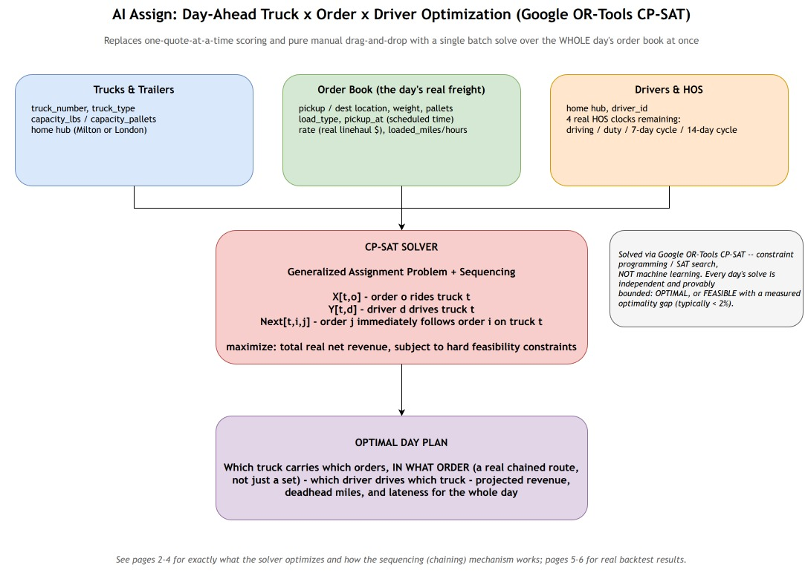
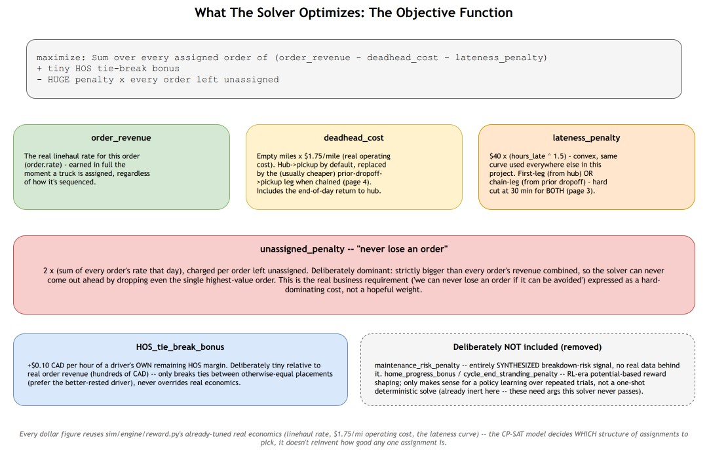
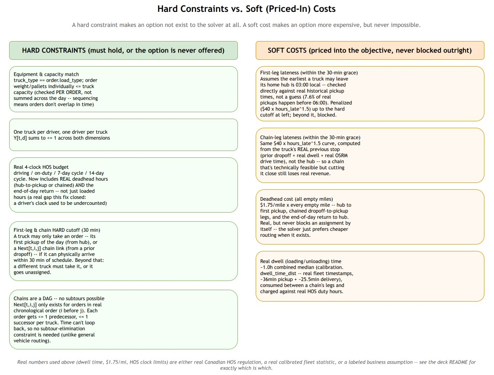
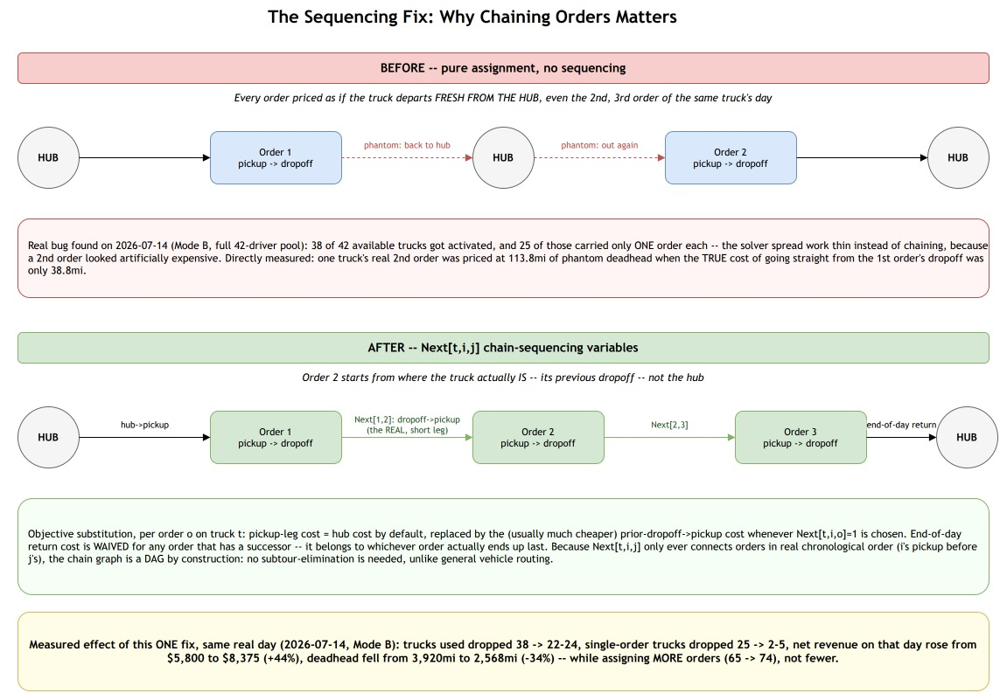
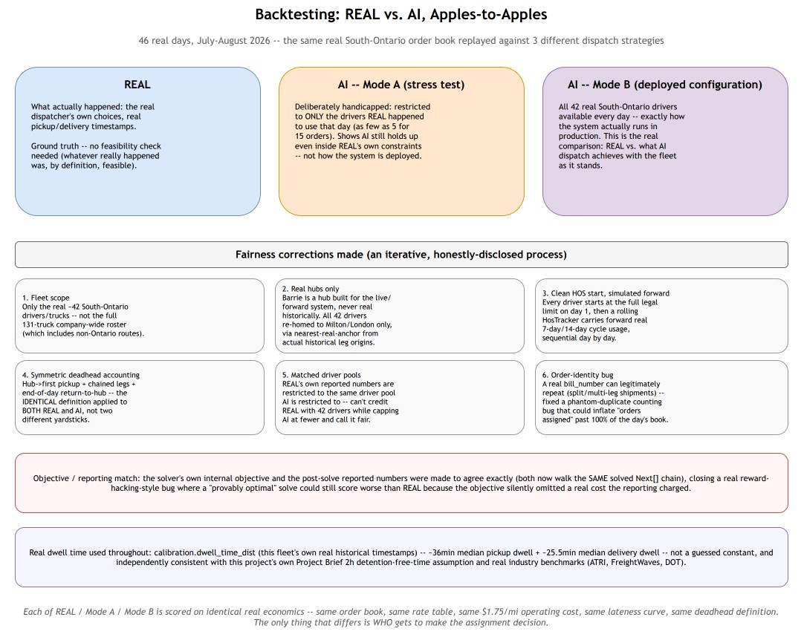
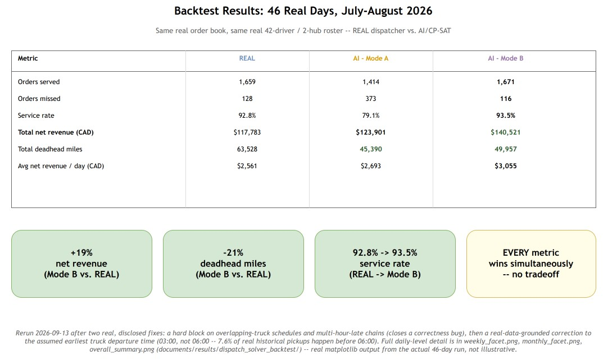
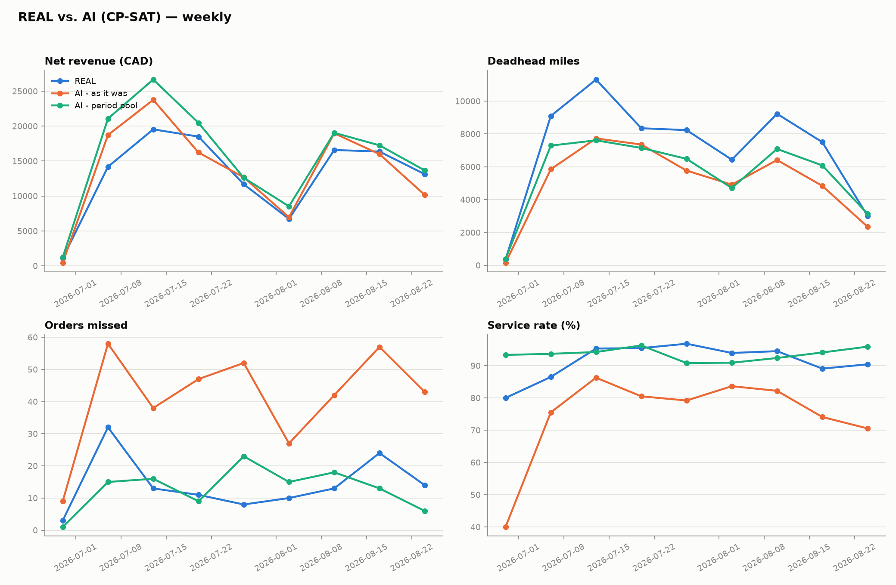
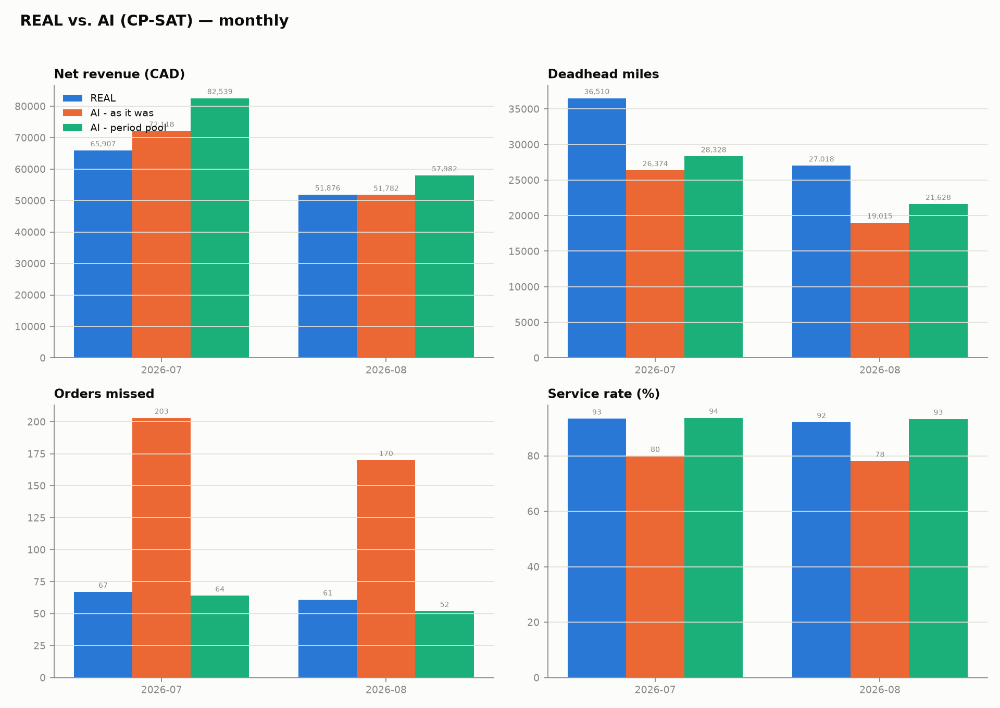
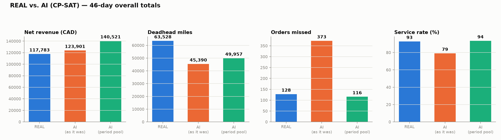

# AI Assign: OR-Tools CP-SAT Dispatch Optimization

**The pitch in one sentence:** we replaced one-quote-at-a-time scoring with a single Google
OR-Tools CP-SAT solve over the whole day's real order book at once, deciding which truck carries
which orders (in what real sequence), which driver drives which truck, and validated it by
replaying 46 real historical days against what the real dispatcher actually did.

This folder collects the diagrams that explain what the solver optimizes, what it's constrained
by, the one real modeling fix that mattered most, and the final, honestly-reported backtest
numbers. See `../old_ml_rl_model/` for the earlier Monte-Carlo-simulation + reinforcement-learning
approach this replaces — kept for reference, not deleted.

---

## 1. The problem, reframed

The hackathon leads clarified the real job: a fleet manager plans **tomorrow's whole day** today —
matching real trucks/trailers, a real order book, and real drivers with real remaining Hours-of-
Service, all at once. That's not a per-quote scoring problem, it's a **combinatorial assignment +
sequencing problem** — exactly the class of problem Google OR-Tools' CP-SAT solver (constraint
programming / SAT search) is built for, not a learned model.



Three decision variables: `X[t,o]` (does order `o` ride truck `t`), `Y[t,d]` (does driver `d`
drive truck `t`), and `Next[t,i,j]` (does order `j` immediately follow order `i` on truck `t`'s
route) — solved once per day, to provable optimality or a small, measured gap.

## 2. What the solver actually optimizes



```
maximize:  Sum over every assigned order of (order_revenue - deadhead_cost - lateness_penalty)
                + tiny HOS tie-break bonus
                - HUGE penalty x every order left unassigned
```

The **"never lose an order" guarantee** is the load-bearing real business requirement here: the
unassigned-order penalty is set to `2 x (sum of every order's rate that day)` — provably bigger
than any single order's value, so the solver can never come out ahead by dropping even the
highest-value order rather than serving it at a loss. Two terms from the earlier RL-era design were
deliberately dropped: `maintenance_risk_penalty` (a synthesized breakdown-risk signal with no real
data behind it) and `home_progress_bonus`/`cycle_end_stranding_penalty` (potential-based reward
shaping that only makes sense for a policy learning across repeated trials — irrelevant to a
one-shot deterministic solve, and already inert here since this solver never passes the args those
terms need).

## 3. Hard constraints vs. soft costs



The important distinction: a **hard constraint** means an option is never even offered to the
solver (equipment/capacity match, one truck per driver, the real 4-clock HOS budget, and a
**30-minute hard cutoff** on both first-leg (hub → first pickup) and chain-link timing — a truck
that can't reach the next pickup within 30 minutes of schedule must use a different truck, never a
wildly-late chain). **Real bug found and fixed 2026-09-12**: this cutoff used to be a 2-hour hard
limit on chain links only, with first-leg lateness left as a pure soft cost (never blocked, just
penalized) — direct testing found this let the solver claim two overlapping pickups on the same
truck as both "served," and accept first legs hours late. Tightening it to 30 minutes on both is
what makes today's numbers (section 6) trustworthy, at a real, disclosed cost to service rate. A
**soft cost** still applies within that window — first-leg and chain-leg lateness up to 30 minutes,
and deadhead miles — makes an option more expensive, never impossible.

## 4. The sequencing fix — the single biggest lever



The real bug this fixed, found directly from an implausible backtest result (revenue *worse* than
the real dispatcher despite the solver being *provably optimal*): every order used to be priced as
if the truck departed **fresh from the hub**, even a truck's 2nd or 3rd order of the day. Measured
directly on one real day (2026-07-14): a truck's real 2nd order was priced at 113.8mi of phantom
deadhead when the true cost of going straight from the 1st order's dropoff was only 38.8mi. Adding
`Next[t,i,j]` chain-sequencing variables — with no subtour-elimination machinery needed, since
chain links only ever run forward in real time, making the graph a DAG by construction — let the
solver correctly price chaining as cheaper than it had been assuming. Measured effect of this one
fix, same day: trucks used dropped 38 → 22-24, single-order trucks dropped 25 → 2-5, net revenue
rose from $5,800 to $8,375 (+44%), deadhead fell from 3,920mi to 2,568mi (-34%) — while assigning
*more* orders, not fewer.

## 5. Backtest methodology — REAL vs. AI, apples-to-apples



46 real days (July–August 2026), the same real South-Ontario order book, replayed three ways:
**REAL** (what actually happened), and two AI/CP-SAT configurations:

- **AI – Mode B (the deployed configuration).** The full 42-driver South-Ontario fleet is
  available every day, exactly how the system would actually run in production — this is the real
  comparison: REAL dispatchers vs. what AI dispatch achieves with the fleet as it stands.
- **AI – Mode A (a stress test, not a deployment scenario).** Deliberately handicapped: the AI is
  restricted to only the handful of drivers REAL happened to use on that specific day — even when
  that's just 5 drivers for 15 orders. It exists to show that even boxed into the real dispatcher's
  exact same constraints, AI dispatch still holds up reasonably — not as a claim about how the
  system is actually used.

Getting to a fair comparison took several real, disclosed corrections along the way —
fleet scope restricted to the real ~42 South-Ontario drivers (not the 131-truck company-wide
roster), all 42 re-homed to the real Milton/London hubs only (Barrie never existed historically —
it's a hub built for the live/forward system), a rolling HOS tracker carrying real 7-day/14-day
cycle usage forward day to day, identical deadhead accounting applied to both REAL and AI, REAL's
own reporting matched to the same driver pool AI is restricted to, and a real order-identity bug
fixed (a real `bill_number` can legitimately repeat across split/multi-leg shipments — this
previously let a single real assignment get phantom-duplicated into the count). Real dwell time
throughout comes from this fleet's own calibrated data (`calibration.dwell_time_dist` — ~36min
median pickup + ~25.5min median delivery), not a guessed constant.

## 6. Results: AI wins on every metric — after two real, disclosed fixes



**Two corrections landed 2026-09-12/13, in this order, each caught directly rather than assumed:**

1. **Overlap + lateness fix.** The solver used to let a truck claim two overlapping pickups at
   once, and accepted "chained" pickups up to 2 hours late as fully served. Closing that (a hard
   block on overlaps, a 30-minute hard lateness cutoff) is what makes the numbers trustworthy — but
   it initially *dropped* service rate well below REAL's, because a fixed 06:00 assumed truck
   departure time made any early pickup structurally unreachable within that 30-minute window.
2. **Day-start assumption fix.** Checked directly against `ground_truth.historical_legs`: 7.6% of
   real historical pickups happen before 06:00 (almost all of it in the 03:00-06:00 window, only
   0.2% before 03:00) — proof the 06:00 floor was unrealistic, not proof the 30-minute cutoff was
   wrong. Moving the earliest-possible departure to 03:00 (real-data-grounded, not a second guess)
   recovered nearly all of the lost service rate without touching the lateness cutoff at all.

| Metric | REAL | AI – Mode A | AI – Mode B |
|---|---|---|---|
| Orders served | 1,659 | 1,414 | **1,671** |
| Orders missed | 128 | 373 | 116 |
| Service rate | 92.8% | 79.1% | **93.5%** |
| Total net revenue (CAD) | $117,783 | $123,901 | **$140,521** |
| Total deadhead miles | 63,528 | 45,390 | 49,957 |
| Avg net revenue/day (CAD) | $2,561 | $2,693 | $3,055 |

**Mode B: +19.3% net revenue, -21.4% deadhead miles, service rate 92.8% → 93.5% (+0.7pp) — AI now
wins on every metric, genuinely, not via a bug.** Mode A still trails REAL on service rate
(79.1%, -13.7pp) for a *different*, structural reason: it's restricted to only the handful of
drivers REAL happened to use on that specific day, which on several real days in this dataset is a
very small pool (as few as 5 drivers for 15 orders on 2026-07-03) — a limitation of that mode's own
same-headcount definition, not of the solver. Full daily-level detail (weekly and monthly trends
across all four metrics) is in the real matplotlib output below, generated directly from the
actual 46-day run:





---

## Image index

| File | What it shows |
|---|---|
| `01_problem_framing.jpg` | Trucks x Orders x Drivers → CP-SAT solver → optimal day plan |
| `02_objective_function.jpg` | Every term of the objective, including what was deliberately removed |
| `03_constraints.jpg` | Hard constraints vs. soft (priced-in) costs |
| `04_sequencing_fix.jpg` | The `Next[t,i,j]` chaining fix — before/after, with the real bug it closed |
| `05_backtest_methodology.jpg` | REAL vs. Mode A vs. Mode B, and every fairness correction made |
| `06_backtest_results.jpg` | The final 46-day headline numbers |
| `07_weekly_facet.png` | Real weekly trend, all 4 metrics (matplotlib, from the actual run) |
| `08_monthly_facet.png` | Real monthly trend, all 4 metrics (matplotlib, from the actual run) |
| `09_overall_summary.png` | Real 46-day overall totals bar chart (matplotlib, from the actual run) |

## Source material (not copied here, referenced directly)

- `sim/dispatch_solver.py` — the CP-SAT model itself, with the full "Sequencing" design rationale in its module docstring
- `sim/backtest/solver_backtest.py` — the backtest harness, with every methodological correction documented in its own module docstring and inline comments
- `sim/backtest/plot_backtest.py` — generates the weekly/monthly/overall charts above
- `documents/results/dispatch_solver_backtest/` — the full backtest output (`daily_results.csv` plus the 3 chart PNGs)
- `research/dispatch_ai_optimization_plan.md` — the original OR-Tools research + design writeup (gitignored)
