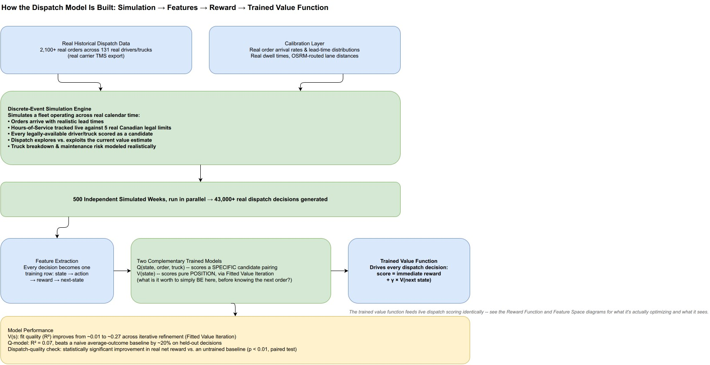
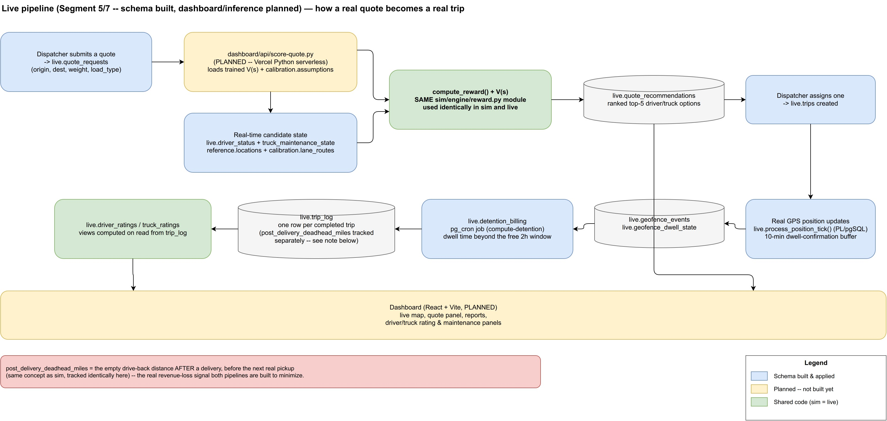

# Database Schema Reference

One place to look up **every table across every schema**: what it holds, where the data came
from, what each column means, and what it's actually used for. Written in response to a real
audit — every number below was queried directly against the live database on 2026-09-08, not
recalled from memory.

Two databases (see [`sim/db.py`](../sim/db.py) and
[`documents/logs/02_infrastructure_setup.md`](logs/02_infrastructure_setup.md)):
**remote Supabase** — `reference`, `ground_truth`, `calibration`, `live` — and **local Postgres**
(Docker, port 5433) — `sim`, `training_transitions`. This doc covers the remote schemas in detail
(where the audit questions were) and summarizes `sim.*` (already detailed in
[`logs/09_discrete_event_simulation.md`](logs/09_discrete_event_simulation.md)).

---

## Audit results — the specific questions asked

**"historical_orders has trip_number null — is that right?"** Yes, and it's exactly as designed.
141 of 2,070 orders (6.8%) have a null `trip_number` — checked directly: **every single one** of
those 141 is an order that was never dispatched (`was_dispatched = false`). Zero dispatched orders
have a null trip number. A `trip_number` only exists once a load actually gets assigned to a
truck; an order that was quoted/booked but never moved simply never got one. This is Known Issue
#1 from `documents/data_dictionary.md`, applied correctly by the loader.

**"driver_equipment is smaller than drivers and trucks — old data? only ~20 drivers/trucks?"**
Checked directly: `ground_truth.drivers` = **131** rows, `ground_truth.trucks` = **131** rows —
not 20. `ground_truth.driver_equipment` = **18** rows, and that's correct too: it only holds
drivers who have a real `DEFAULT_PUNIT` (a specific truck) on file in the source Excel — checked
directly against the raw `Driver` sheet, cleaning the `<null>` string sentinel first (Known Issue
#8 — without that cleaning step this column looks like it has 98 non-null values, not 18, because
the literal string `"<null>"` isn't recognized as missing by pandas until it's replaced). The
other 113 drivers simply have no fixed truck recorded anywhere in the source data — not a bug, a
real gap in what the TMS export tracks. (Full detail on how this shaped the simulator's
driver↔truck design: `logs/10_run_sim_fleet_and_schema_audit.md`.)

**General structural check** (ids, types, foreign keys — see "Verified checks" below): no orphaned
foreign keys anywhere, no type mismatches, `reference.locations` coordinates all fall inside the
coverage bounding box, `ground_truth.trailers` count (425) matches the raw Excel exactly with zero
duplicates. Everything is sound.

### Verified checks (run 2026-09-08)

| Check | Result |
|---|---|
| All expected tables exist in all 4 remote schemas + `public` (PostGIS/profile tables) | ✅ 29 tables found |
| `ground_truth.driver_equipment` rows all have a matching `truck_number` in `ground_truth.trucks` | ✅ 0 orphans |
| `ground_truth.historical_legs.driver_id` all match a real `ground_truth.drivers.driver_id` (where not null) | ✅ 0 orphans (252/5,176 legs have a null `driver_id` — the `NAME`→`DRIVER_ID` join didn't resolve for those; a known best-effort join limit, not corruption) |
| `reference.locations` lat/lon all inside `COVERAGE_BBOX` | ✅ range (42.94–44.39, -81.29 to -78.29), matches the padded box in `sim/config.py` |
| `ground_truth.trailers` row count vs. raw Excel `Trailers` sheet | ✅ 425 = 425, 0 duplicate `TRAILER_NUMBER` |
| `calibration.*` column types (all `numeric`/`integer`/`text`/`jsonb` as designed) | ✅ matches `sim/sql/004_calibration.sql` exactly |
| `historical_orders.was_dispatched=true` rows all have a non-null `trip_number` | ✅ 0 mismatches |

---

## `reference` schema — where things are

### `reference.locations` (2,110 rows)
Every physical point the simulator or live system can reference: real shipper/consignee
addresses, synthetic facility points, and the 2 terminal hubs.

| Column | Meaning |
|---|---|
| `location_id` | Primary key, referenced everywhere else as an integer (not a lat/lon pair) |
| `label` | Human-readable name — a real business name, `Synthetic facility osm#<id>`, or `RoadStar Terminal — London/Milton` |
| `city`, `province` | Normalized city name (Known Issue #6 fix applied), always `ON` |
| `tier` | `real_customer` (Nominatim-geocoded), `synthetic_facility` (Overpass/OSM industrial POIs), or `terminal_hub` |
| `geog` | PostGIS `geography(Point, 4326)` — the actual coordinate, real GPS math (`ST_DWithin` etc.) works directly on this |
| `source` | `nominatim` / `overpass` / `manual` (the 2 hubs) |
| `near_highway`, `buffer_minutes`, `radius_m` | Geofencing parameters — which highway it's near (informational), and the dwell-confirmation buffer/radius used by `live.process_position_tick()` |

**Use case**: every order, trip, and route in the system resolves through a `location_id` here.
`geog` is what powers real distance math; everything else is metadata for the dashboard and geofencing.

---

## `ground_truth` schema — the real historical export, cleaned and loaded

Loaded by `sim/load_ground_truth.py` from the source Excel, Ontario-to-Ontario orders only,
every Known Issue from `documents/data_dictionary.md` applied at load time.

### `ground_truth.drivers` (131 rows)
One row per real driver (after dropping 38 blank placeholder rows — Known Issue #12).
`home_zone`, `driver_type`, `pay_type`, `driver_cycle`, `terminal_zone` (`RSTAR` or `ONMIL` —
which hub they're based at), `default_punit` is **not** stored here — see `driver_equipment` below.

### `ground_truth.trucks` (131 rows)
Just `truck_number` — the entire roster. The source Excel's `Trucks` sheet has exactly one
column; there is no odometer, service history, make, model, or year anywhere in the export. This
is why truck maintenance is entirely synthesized (`sim/engine/maintenance.py`) — there's nothing
real to calibrate it against.

### `ground_truth.trailers` (425 rows)
Roster only — `trailer_number`, `trailer_type`, `capacity_lbs`. **Does not join to
`Dispatch.LS_TRAILER1`** (Known Issue #5) — trailer capacity for the simulator is resolved per
order from `load_type` instead (`sim/config.py`'s `CAPACITY_BY_LOAD_TYPE`), not from a specific
trailer record.

### `ground_truth.driver_equipment` (18 rows)
`driver_id` → `truck_number`, for the 18/131 drivers who have a real `DEFAULT_PUNIT` on file.
**Deliberately small** — see the audit answer above. This is the one real signal the simulator
uses to decide which drivers get a tight "single-truck-user" truck pool vs. a wider synthesized one.

### `ground_truth.historical_orders` (2,070 rows)
One row per ON→ON order (`Tlorder` sheet). `bill_number` (PK), `trip_number` (null iff never
dispatched — see audit above), `origin_location_id`/`dest_location_id` (best-effort match into
`reference.locations` by normalized city name — not every order matches both ends), timestamps,
`distance_miles`, `weight_lbs`, `pallets`, `load_type`, `temp_controlled`.

**Use case**: (a) the calibration script's bootstrap pool for generating realistic simulated
order weight/pallet/load_type combinations; (b) backtesting real detention/deadhead dollar
figures against actual history.

### `ground_truth.historical_legs` (5,176 rows)
One row per dispatch leg (`Dispatch` sheet), the raw material `classify_run_type()` was built
from. `leg_id` (PK), `trip_number`, `leg_seq`, `driver_id` (null for 252 legs — the join
limitation noted above), `mt_loaded`, `leg_dist`, `leg_weight`, `det_pick_arrive`/`det_delv_arrive`
(detention timestamps), `last_fb_status` (the real TMS status vocabulary), `run_type` (the
retrospective 8-category classification — see `logs/03_run_type_classifier.md`).

---

## `calibration` schema — the numbers that make the simulator realistic

Seeded by `sim/build_calibration.py`. Two kinds of table here: numbers **re-derived from the same
source Excel** the notebook already validated (not scraped from notebook cells — see
`logs/08_calibration_and_routing.md`), and two genuinely **new** tables that couldn't exist until
`reference.locations` did.

### `calibration.run_type_transition` (40 rows)
`from_run_type`, `to_run_type`, `probability` — for a given driver's *previous* completed run
type, the real historical odds of what their *next* run type was (driver-chronological adjacency,
the same logic validated in `data_analysis.ipynb`). **Not currently consumed by `run_sim.py`**
yet — it's a validated real distribution available for a future refinement of the post-completion
branch logic (which today uses the simpler `TRANSITION_PRIORS` in `state.py`).

### `calibration.dwell_time_dist` (10 rows) — "what is p25/median/p75 for?"
One row per (`run_type`, `phase`) where `phase` is `pickup` or `delivery`. `p25_minutes` /
`median_minutes` / `p75_minutes` describe the **real shape of how long a truck sits at the dock**
— computed from real timestamps (`ACTUAL_PICKUP`/`ACTUAL_DELIVERY` minus the detention-arrival
timestamps). The simulator can't just use one fixed number (real dwell times vary a lot — some
loads take 15 minutes, some take 2 hours), so it needs the **shape** of that variation, not just
an average:
- `p25_minutes` — the 25th percentile: a quick pickup/delivery, one out of every four is faster than this
- `median_minutes` — the middle value: half of all real dock visits were faster, half slower
- `p75_minutes` — the 75th percentile: one out of every four is slower than this

`run_sim.py` samples a **triangular distribution** using these three numbers every time it needs
a dwell time for a simulated trip — this gives realistic variation (sometimes fast, sometimes
slow, clustered around the real median) instead of every single trip taking exactly the same dwell.

### `calibration.hos_remaining_at_completion` (8 rows)
`run_type` → `median_hours` — the real median value of the source data's `REMAINING_HOURS` field
at the end of a completed run of that type. **Important caveat, carried over from earlier in this
build**: `REMAINING_HOURS` is a live snapshot in the source data, not a verified historical value
tied to that specific trip. Used only to give the simulator's driver-initialization a
realistic-*looking* starting distribution (some drivers start a simulation with more of their
weekly hours already used than others) — not presented as ground truth.

### `calibration.lane_frequency` (135 rows) — NEW, didn't exist before this project
`origin_location_id`, `dest_location_id`, `weight` — how many real historical orders actually ran
between these two locations. 1,777 of 2,109 ON-ON orders matched both ends to a real
`reference.locations` row. **Use case**: `run_sim.py` draws simulated orders' origin/destination
by weighted random choice from this table — so simulated demand follows the SAME real lanes
actual freight moved on, not arbitrary origin/destination pairs.

### `calibration.order_arrival_rate` (85 rows) — NEW
`hour_of_day`, `day_of_week` → `lambda` (a Poisson rate). How many orders per hour, real
historical average, broken out by hour-of-day and day-of-week (from real `CREATED_TIME`
timestamps). **Use case**: `run_sim.py`'s order-arrival event scheduler draws inter-arrival times
from this — busier hours generate orders faster, exactly matching the real historical pattern.

### `calibration.lane_routes` (8,486 rows)
`origin_location_id`, `dest_location_id` → `distance_m`, `duration_s`, `geometry` (GeoJSON).
Real OSRM-computed driving routes — every location routed to/from both terminal hubs (both
directions) plus every real historical lane. See `logs/08_calibration_and_routing.md` for why
it's this scope and not full pairwise (~4.45M pairs would be excessive and mostly useless).

### `calibration.assumptions` (7 rows)
**Every synthesized dollar figure or rate in the whole system, in ONE place**, with the reasoning
written inline (`key`, `value`, `unit`, `rationale`). This is the runtime source of truth — the
reward function, backtests, and eventually the dashboard's `$`-figure components all read these
rows rather than hardcoding a number a second time.

| key | value | unit |
|---|---|---|
| `linehaul_rate_per_mile` | 3.25 | CAD/mile |
| `operating_cost_per_mile` | 1.75 | CAD/mile |
| `detention_rate_per_hr_cad` | 75.0 | CAD/hour |
| `detention_free_hours` | 2 | hours |
| `breakdown_expected_cost_cad` | 2000.0 | CAD |
| `breakdown_event_penalty_cad` | 8000.0 | CAD |
| `capacity_value_rate_per_lb` | 0.01 | CAD/lb |

None of these exist in the source data — checked column by column, confirmed in
`documents/domain_deep_dive_and_eda_plan.md`.

---

## `live` schema — the real production system (schema built, all tables currently empty)

Every `live.*` table currently has **0 rows** — this is expected. Nothing has run through the live
system yet; the schema exists and is ready (migrations `006`/`008`/`010`/`011` applied and
verified), waiting for the dashboard + inference function (`dashboard/api/score-quote.py`, not yet
built) to actually generate real quotes and trips.

### `live.driver_status` — one row per driver, live/current
`position` (PostGIS point), `last_location_id`, `speed_mph`, `hos_remaining_hours`,
`duty_status`, `current_trip_id`, `truck_number`, `trailer_type`/capacity. Updated continuously
from real GPS + ELD feeds once live. This is the real-world equivalent of the simulator's
`DriverState` + `TruckState` combined.

### `live.trips` — one row per active/recent trip
`trip_id`, `driver_id`, `status`, `last_event`, `eta`. The live equivalent of a `TripState`,
minimal columns here because the full status history lives in `live.geofence_events` +
`sim.trip_events`'s live counterpart.

### `live.geofence_events` / `live.geofence_dwell_state`
Raw arrival/departure events at a geofenced location, and the 10-minute dwell-confirmation buffer
state (`sim/config.py`'s `GEOFENCE_DWELL_BUFFER_MINUTES`) that prevents a GPS blip from falsely
triggering an arrival/departure. Written by `live.process_position_tick()` (PL/pgSQL,
`sim/sql/008_geofence_function.sql`).

### `live.detention_billing`
Computed by a scheduled `pg_cron` job (`compute-detention`, `sim/sql/010_cron_detention.sql`) —
dwell time beyond the contractual free window (`detention_free_hours` = 2h) billed at
`detention_rate_per_hr_cad`.

### `live.quote_requests` / `live.quote_recommendations`
A dispatcher's quote request (origin, destination, weight, load_type) and the ranked
recommendations the (planned) inference function returns — the live equivalent of `run_sim.py`'s
`choose_assignment()`, called once per real quote instead of once per simulated order arrival.

### `live.vehicle_inspections`
Driver pre-trip inspection records — feeds the dashboard's "is this truck cleared to go"
blocking check (`overall_pass` flag), independent of the odometer-based maintenance model.

### `live.truck_maintenance_state`
The live equivalent of `TruckMaintenanceState` — real odometer/service tracking once trucks
report real mileage, using the same `MAINTENANCE_SERVICE_INTERVAL_KM` threshold as the simulator.

### `live.trip_log` — one row per COMPLETED trip (real or simulated)
This is the audit trail. `post_delivery_deadhead_miles` — **"is this the drive-back distance
after delivery?"** Yes, exactly: the empty miles driven *after* a delivery is complete and
*before* the next real (revenue-earning) pickup. It's tracked separately from
`pre_pickup_deadhead_miles` (the empty drive *to* a pickup, which is normal/expected and not
penalized) because post-delivery deadhead is the real revenue-loss signal — a truck sitting empty
after dropping off, with nowhere productive to go next. Same concept, same column, same meaning
in both the simulator (`TripState.post_delivery_deadhead_miles` in `sim/engine/state.py`) and here
in live — one shared definition, not two.

### `live.driver_ratings` / `live.truck_ratings` (views, not tables)
Computed on read directly from `trip_log` — on-time rate, average post-delivery-deadhead,
breakdown count, average load fill ratio. Feeds the dashboard's driver-stats and
maintenance-warning panels. Views, not separately-maintained tables, so there's exactly one source
of truth (a driver's rating can never drift out of sync with the trips it's computed from).

---

## `sim` schema (local Postgres) — simulation exhaust

Full detail in `logs/09_discrete_event_simulation.md`. Quick summary: `sim.runs` (one row per
simulation run), `sim.orders`/`sim.assignments`/`sim.trip_events` (everything that happened during
that run, bulk-written at the end), `sim.hos_transitions`/`sim.position_ticks` (finer-grained,
not yet populated by `run_sim.py`'s current MVP). No foreign keys to the remote schemas — cannot
be enforced across two separate Postgres instances, so referential integrity here is guaranteed
by the application (`run_sim.py` only ever writes IDs it already loaded from the remote side).

---

## Model training & live inference — planned pipelines

Two diagrams cover how the pieces already built here feed into the not-yet-built model training
and live-serving pipelines:

**Training pipeline** (`diagrams/pipeline_training.jpg`) — many parallel `run_sim.py` runs write
to local `sim.*`; `extract_transitions.py` (not yet built) turns that into
`(state, action, reward, next_state)` rows in `training_transitions`; `train_value_function.py`
(not yet built) fits a GBM/XGBoost value function on the GB10's GPU; the trained model feeds the
live pipeline. Policy iteration (re-running sims with the trained value function to generate
better training data) is a stretch goal, not committed.

**Live pipeline** (`diagrams/pipeline_live.jpg`) — a real quote request flows through the
(not-yet-built) `dashboard/api/score-quote.py` serverless function, which loads the trained value
function plus `calibration.assumptions`, builds real-time candidates from `live.driver_status` +
`live.truck_maintenance_state`, and scores them with the **exact same** `compute_reward()`
function the simulator uses — one shared codepath, not two parallel implementations that could
drift apart. Ranked results land in `live.quote_recommendations`; once a dispatcher assigns one,
real GPS/geofence events drive `live.trips` through to `live.trip_log`, feeding the rating views
that power the dashboard.

---

## Related documents

- [`data_dictionary.md`](data_dictionary.md) — the source Excel's raw column meanings and the 12 Known Issues
- [`logs/05_ground_truth_loading.md`](logs/05_ground_truth_loading.md) — how `ground_truth.*` was loaded, issue by issue
- [`logs/08_calibration_and_routing.md`](logs/08_calibration_and_routing.md) — how `calibration.*` was built
- [`logs/09_discrete_event_simulation.md`](logs/09_discrete_event_simulation.md) — the `sim.*` schema in use
- [`logs/10_run_sim_fleet_and_schema_audit.md`](logs/10_run_sim_fleet_and_schema_audit.md) — the driver↔truck pool redesign and this audit's origin
- [`diagrams/sim_run_walkthrough.drawio`](diagrams/sim_run_walkthrough.drawio) — one real simulated trip, step by step
